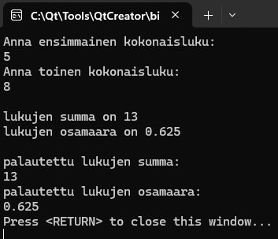
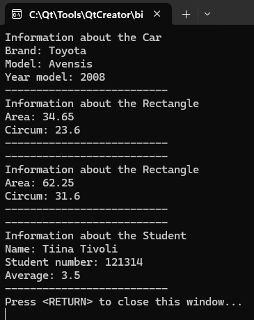
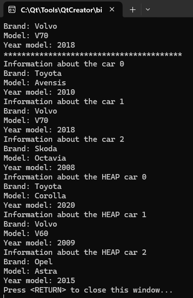
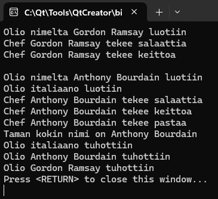
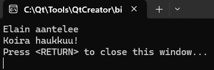

# Olio-ohjelmoinnin harjoitustehtäviä

## Kotitehtävä1

Tehtävässä harjoitellaan muuttujien, funktioiden ja ehtorakenteiden käyttöä.
Tehtävää varten luotiin neljä funktiota:

**calcSum**

- parametreinä kaksi kokonaislukua
- tulostaa näiden summan

**calcDiv**

- parametreinä kaksi kokonaislukua
- tulostaa näiden osamäärän

**retSum**

- parametreinä kaksi kokonaislukua
- palauttaa näiden summan
    
**retDiv**

- parametreinä kaksi kokonaislukua
- palauttaa näiden osamäärän

Main -koodissa kysytään käyttäjältä 2 kokonaislukua ja sijoitetaan ne muuttujiin.
Kutsutaan edellä mainittuja funktioita ja jälkimmäisten funktioiden kohdalla myös tulostetaan funktioiden palautusarvot.

## Kotitehtävä2a

Tehtävässä harjoitellaan luokkien ja olioiden käyttöä.

**Ensimmäisessä vaiheessa luodaan Car -luokka ja Car -olio tehdään pinomuistiin**

Jäsenmuuttujat:
- Merkki, malli, vuosimalli.

Metodit:
- Setterit jäsenmuuttujille
- Funktio "printData", jolla voidaan tulostaa auton tiedot.

**Toisessa vaiheessa luodaan Rectangle -luokka ja Rectangle -olio tehdään kekomuistiin pointter-oliona**

Jäsenmuuttujat:
- leveys, korkeus

Metodit:
- Setterit jäsenmuuttujille
- Funktio suorakulmion pinta-alaa varten, palautusarvona pinta-ala
- Funktio suorakulmion ympärysmittaa varten, palautusarvona ympärysmitta

**Kolmannessa vaiheessa luodaan Student -luokka ja Student -olio tehdään kekomuistiin smartpointter-oliona**

Jäsenmuuttujat:
- nimi, opiskelijanumero, keskiarvo

Metodit:
- Setterit jäsenmuuttujille
- Getterit jäsenmuuttujille

**Main -koodissa luodaan neljä oliota**

Car -olio pinomuistiin.
- Settereiden avulla annetaan tiedot autolle
- Tulostetaan auton tiedot luokan metodeissa olevalla funktiolla
- Olio poistuu automaattisesti

Rectangle -olio kekomuistiin, pointter-oliona
- Settereiden avulla annetaan suorakulmion leveys ja korkeus
- Tulostetaan suorakulmion pinta-ala ja ympärysmitta metodeissa olevien funktioita hyödyntäen
- Poistetaan olio koodissa

Rectangle -olio kekomuistiin, pointter-oliona
- Oliolle annetaan muodostimen parametreina valmiiksi suorakulmion leveys ja korkeus
- Tulostetaan suorakulmion pinta-ala ja ympärysmitta metodeissa olevien funktioita hyödyntäen
- Poistetaan olio koodissa

Student -olio kekomuistiin, smartpointter -oliona
- Settereiden avulla annetaan opiskelijalle nimi, opiskelijanumero ja keskiarvo
- Tulostetaan opiskelijan tiedot Gettereiden avulla
- Olio poistuu tuhoajan avulla

## Kotitehtävä2b

Tässä tehtävässä tutustutaan C++ ohjelmoinnin käsitteeseen vektori ja kuinka sitä käyttäen luodaan ns. oliolista

**Luodaan luokka Car**

Jäsenmuuttujat:
- Merkki, malli, vuosimalli.

Metodit:
- "Car" muodostin, jossa auton tiedot annetaan parametreissa
- Funktio "printData", jolla voidaan tulostaa auton tiedot.

**Main -koodi**

Luodaan vektori nimeltä "carList", lista luodaan pinomuistiin
- luodaan 3 Car luokan oliota, tiedot annetaan parametreissa
- Lisätään oliot "carList" listaan
- Tulostetaan listan toisen alkion tiedot
- Tulostetaan kaikkien autojen tiedot for-silmukkaa käyttäen

Lisätehtävänä

Luodaan vektori nimeltä "carList2", lista luodaan kekomuistiin smartpointterina
- luodaan 3 Car luokan oliota, tiedot annetaan parametreissa
- Lisätään oliot "carList2" listaan
- Haetaan lista carList2 -osoittimesta
- Tulostetaan kaikkien autojen tiedot for-silmukkaa käyttäen. Käytetään tulostuksessa listan elementtiä 'cars'.

## Kotitehtävä3a

Tehtävässä harjoitellaan perintää ja UML-luokkakaavioiden tulkintaa

**Luodaan kantaluokka Chef**

Luodaan Chef luokka, jossa:

Protected jäsenmuuttujana
- name
Public jäseninä
- Konstruktori, jolle annetaan parametreina kokin nimi
- Funktio "makeSalad"
- Funktio "makeSoup"

**Luodaan aliluokka ItalianChef**

Luodaan ItalianChef luokka, joka perii luokan Chef:

Public jäseninä
- Konstruktori, jolle annetaan parametreina kokin nimi sekä kutsutaan Chef luokan konstruktoria
- Funktio "getName"
- Funktio "makePasta"

Lisäksi luokalla on on pääsy Chef luokan Public- ja Protected-jäseniin

**Main -koodi**

Ensin luodaan automaattinen Chef luokan olio pinomuistiin.
- Annetaan kokin nimi parametrina konstruktorille
- Kutsutaan luokan julkisia funktioita
- Konstruktoriin, destruktoriin sekä funktioihin on kaikkiin laitettu tulosteet debuggauksen vuoksi

Seuraavaksi luodaan automaanen ItalianChef luokan olio pinomuistiin
- Annetaan kokin nimi parametrina konstruktorille, jossa myös kutsutaan Chef luokan konstruktoria
- Kutsutaan Chef luokan funktioita
- Kutsutaan ItalianChef luokan funktioita

## Kotitehtävä3b

Tehtävässä harjoitellaan luokkien periytymistä ja metodien ylikirjoittamista.

**Perittävä luokka Animal**

Luodaan luokka Animal

Public jäseninä
- Konstruktori
- Virtual destruktori
- Funktio "callOut". Tulostaa tekstin "Elain aantelee"

**Perivä luokka Dog**

Luodaan luokka Dog, joka perii luokan Animal. Luokalla on pääsy Animal luokan Public- ja Protected-jäseniin

Public jäseninä
- Konstruktori
- Destruktori
- Funktio "callOut". Ylikirjoitetaan tulostamaan teksti "Koira haukkuu!"

**Main koodi**

Luodaan Animal luokan olio pointterina kekomuistiin
- Kutsutaan "callOut" -funktiota

Luodaan Dog luokan olio pointterina kekomuistiin
- Kutsutaan "callOut" -funktiota, joka on ylikirjoitettu kirjoittamaan eriävä teksti

Poistetaan molemmat oliot lopuksi

