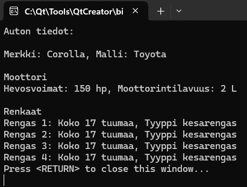
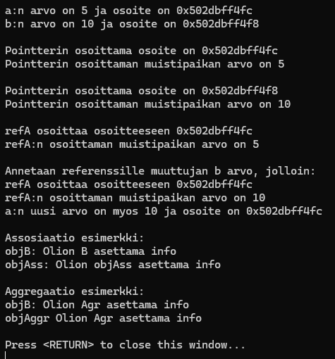
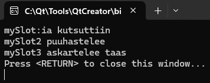

# Olio-ohjelmoinnin harjoitustehtäviä

## Kotitehtävä1

Tehtävässä harjoitellaan muuttujien, funktioiden ja ehtorakenteiden käyttöä.
Tehtävää varten luotiin neljä funktiota:

**calcSum**

- parametreinä kaksi kokonaislukua
- tulostaa näiden summan

**calcDiv**

- parametreinä kaksi kokonaislukua
- tulostaa näiden osamäärän

**retSum**

- parametreinä kaksi kokonaislukua
- palauttaa näiden summan
    
**retDiv**

- parametreinä kaksi kokonaislukua
- palauttaa näiden osamäärän

Main -koodissa kysytään käyttäjältä 2 kokonaislukua ja sijoitetaan ne muuttujiin.
Kutsutaan edellä mainittuja funktioita ja jälkimmäisten funktioiden kohdalla myös tulostetaan funktioiden palautusarvot.

## Kotitehtävä2a

Tehtävässä harjoitellaan luokkien ja olioiden käyttöä.

**Ensimmäisessä vaiheessa luodaan Car -luokka ja Car -olio tehdään pinomuistiin**

Jäsenmuuttujat:
- Merkki, malli, vuosimalli.

Metodit:
- Setterit jäsenmuuttujille
- Funktio "printData", jolla voidaan tulostaa auton tiedot.

**Toisessa vaiheessa luodaan Rectangle -luokka ja Rectangle -olio tehdään kekomuistiin pointter-oliona**

Jäsenmuuttujat:
- leveys, korkeus

Metodit:
- Setterit jäsenmuuttujille
- Funktio suorakulmion pinta-alaa varten, palautusarvona pinta-ala
- Funktio suorakulmion ympärysmittaa varten, palautusarvona ympärysmitta

**Kolmannessa vaiheessa luodaan Student -luokka ja Student -olio tehdään kekomuistiin smartpointter-oliona**

Jäsenmuuttujat:
- nimi, opiskelijanumero, keskiarvo

Metodit:
- Setterit jäsenmuuttujille
- Getterit jäsenmuuttujille

**Main -koodissa luodaan neljä oliota**

Car -olio pinomuistiin.
- Settereiden avulla annetaan tiedot autolle
- Tulostetaan auton tiedot luokan metodeissa olevalla funktiolla
- Olio poistuu automaattisesti

Rectangle -olio kekomuistiin, pointter-oliona
- Settereiden avulla annetaan suorakulmion leveys ja korkeus
- Tulostetaan suorakulmion pinta-ala ja ympärysmitta metodeissa olevien funktioita hyödyntäen
- Poistetaan olio koodissa

Rectangle -olio kekomuistiin, pointter-oliona
- Oliolle annetaan muodostimen parametreina valmiiksi suorakulmion leveys ja korkeus
- Tulostetaan suorakulmion pinta-ala ja ympärysmitta metodeissa olevien funktioita hyödyntäen
- Poistetaan olio koodissa

Student -olio kekomuistiin, smartpointter -oliona
- Settereiden avulla annetaan opiskelijalle nimi, opiskelijanumero ja keskiarvo
- Tulostetaan opiskelijan tiedot Gettereiden avulla
- Olio poistuu tuhoajan avulla

## Kotitehtävä2b

Tässä tehtävässä tutustutaan C++ ohjelmoinnin käsitteeseen vektori ja kuinka sitä käyttäen luodaan ns. oliolista

**Luodaan luokka Car**

Jäsenmuuttujat:
- Merkki, malli, vuosimalli.

Metodit:
- "Car" muodostin, jossa auton tiedot annetaan parametreissa
- Funktio "printData", jolla voidaan tulostaa auton tiedot.

**Main -koodi**

Luodaan vektori nimeltä "carList", lista luodaan pinomuistiin
- luodaan 3 Car luokan oliota, tiedot annetaan parametreissa
- Lisätään oliot "carList" listaan
- Tulostetaan listan toisen alkion tiedot
- Tulostetaan kaikkien autojen tiedot for-silmukkaa käyttäen

Lisätehtävänä

Luodaan vektori nimeltä "carList2", lista luodaan kekomuistiin smartpointterina
- luodaan 3 Car luokan oliota, tiedot annetaan parametreissa
- Lisätään oliot "carList2" listaan
- Haetaan lista carList2 -osoittimesta
- Tulostetaan kaikkien autojen tiedot for-silmukkaa käyttäen. Käytetään tulostuksessa listan elementtiä 'cars'.

## Kotitehtävä3a

Tehtävässä harjoitellaan perintää ja UML-luokkakaavioiden tulkintaa

**Luodaan kantaluokka Chef**

Luodaan Chef luokka, jossa:

Protected jäsenmuuttujana
- name
Public jäseninä
- Konstruktori, jolle annetaan parametreina kokin nimi
- Funktio "makeSalad"
- Funktio "makeSoup"

**Luodaan aliluokka ItalianChef**

Luodaan ItalianChef luokka, joka perii luokan Chef:

Public jäseninä
- Konstruktori, jolle annetaan parametreina kokin nimi sekä kutsutaan Chef luokan konstruktoria
- Funktio "getName"
- Funktio "makePasta"

Lisäksi luokalla on on pääsy Chef luokan Public- ja Protected-jäseniin

**Main -koodi**

Ensin luodaan automaattinen Chef luokan olio pinomuistiin.
- Annetaan kokin nimi parametrina konstruktorille
- Kutsutaan luokan julkisia funktioita
- Konstruktoriin, destruktoriin sekä funktioihin on kaikkiin laitettu tulosteet debuggauksen vuoksi

Seuraavaksi luodaan automaanen ItalianChef luokan olio pinomuistiin
- Annetaan kokin nimi parametrina konstruktorille, jossa myös kutsutaan Chef luokan konstruktoria
- Kutsutaan Chef luokan funktioita
- Kutsutaan ItalianChef luokan funktioita

## Kotitehtävä3b

Tehtävässä harjoitellaan luokkien periytymistä ja metodien ylikirjoittamista.

**Perittävä luokka Animal**

Luodaan luokka Animal

Public jäseninä
- Konstruktori
- Virtual destruktori
- Funktio "callOut". Tulostaa tekstin "Elain aantelee"

**Perivä luokka Dog**

Luodaan luokka Dog, joka perii luokan Animal. Luokalla on pääsy Animal luokan Public- ja Protected-jäseniin

Public jäseninä
- Konstruktori
- Destruktori
- Funktio "callOut". Ylikirjoitetaan tulostamaan teksti "Koira haukkuu!"

**Main koodi**

Luodaan Animal luokan olio pointterina kekomuistiin
- Kutsutaan "callOut" -funktiota

Luodaan Dog luokan olio pointterina kekomuistiin
- Kutsutaan "callOut" -funktiota, joka on ylikirjoitettu kirjoittamaan eriävä teksti

Poistetaan molemmat oliot lopuksi

## Kotitehtävä2a

Tehtävässä harjoitellaan vahvaa koostetta ja UML-luokkakaavion tulkintaa.
Tehtävässä on koosteluokka Car.
Tehtävässä on Car -luokan olio, joka luo Engine luokan olion sekä 4 Wheel luokan oliota.

**Engine luokka**

Private jäsenmuuttujat:
- horsepower, displacement

Public jäseninä:
- konstruktori
- konstruktori, parametreina hevosvoimat ja moottorintilavuus
- Getterit jäsenmuuttujille
- Setterit jäsenmuuttujille

**Wheel luokka**

Private jäsenmuuttujat:
- size, type

Public jäseninä:
- konstruktori
- konstruktori, parametreina rengaskoko ja -tyyppi
- Getterit jäsenmuuttujille
- Setterit jäsenmuuttujille

**Car luokka**

Private jäseninä:
- jäsenmuuttujat brand ja model
- Engine luokan olio
- neljä Wheel luokan oliota

Public jäseninä:
- konstruktori
- konstruktori, parametreina auton merkki ja malli
- funktio setEngine() moottorin tietojen asettamiseen
- funktio setWheels() renkaiden tietojen asettamiseen
- funktio printDetails() auton tietojen tulostamista varten
- Getterit jäsenmuuttujille
- Setterit jäsenmuuttujille

**Main koodi**

Luodaan Car luokan olio, jolle annetaan parametreina auton merkki ja malli.

Kutsutaan setEngine() ja setWheels() funktioita, jolla asetetaan auton moottorin sekä renkaiden tiedot

Kutsutaan printDetails() funktiota, jolla tulostetaan auton tiedot

## Kotitehtävä5

Tehtävässä kerrataan muistiosoitteeseen ja pointeriin liittyviä asioita, sekä tutustutaan referenssin käyttöön

**ClassB luokka**

Private jäsenenä
- info
Public jäseninä
-Getterit ja Setterit info -muuttujalle

**AssosiationA luokka**

Private jäsenenä:
- ClassB luokan olio, objectB

Public jäseninä
- konstruktori, parametrina ClassB luokan olio
- getBinfo() -funktio, palauttaa objectB:n Getterin arvon
- setBinfo(string) -funktio, asetetaan objectB:lle Setterin avulla arvo

**AggregationA luokka**

Private jäsenenä
- referenssi ClassB luokan olioon, &refB

Public jäseninä
- konstruktori, parametrina ClassB luokan referenssi
- getBinfo() -funktio, palauttaa objectB:n Getterin arvon
- setBinfo(string) -funktio, asetetaan objectB:lle Setterin avulla arvo

**main koodi**

Vaihe 1:

- luodaan int muuttujat a ja b, joille asetetaan arvoiksi 5 ja 10
- luodaan pointer 'myPointer', johon sijoitetaan vuorotellen muuttujien a ja b osoitteet
- luodaan referenssi 'refA', joka viittaa muuttujaan a, mutta myöhemmin annetaan b muuttujan arvo
- Havainnollistetaan näiden toimintaa tulostamalla muuttujien, pointerin ja referenssin muistipaikkojen osoitteita sekä arvoja

Vaihe 2:

- luodaan ClassB luokan olio, objB
- setInfo() funktion avulla asetetaan teksti "Olion B asettama info"
- luodaan AssosiationA luokan olio objAss, jolla parametrina objB
- setBinfo() funktion avulla asetetaan teksti "Olion objAss asettama info"
- tulostetaan olioille asetetut tekstit getinfo() ja getBinfo() funktioiden avulla

Vaihe 3:

- luodaan ClassB luokan referenssi &refB, jolla viitataan ClassB luokan olioon objB
- luodaan AggregationA luokan olio objAggr, parametrina refB
- setBinfo() funktion avulla asetetaan teksti "Olion objAggr asettama info"
- tulostetaan olioille asetetut tekstit getinfo() ja getBinfo() funktioiden avulla

## Kotitehtävä6a

Tässä tehtävässä tutustutaan QObjectin tarkoitukseen ja Q_OBJECT makroon.
Käytetään tapahtuma/sanomajonoa 'signals & slots'.
.pro -tiedostosta poistetaan rivi 'CONFIG -= qt' ja lisätään rivi 'QT = core'

**MyClass luokka**

Perii QObject luokan ja suorittaa Q_OBJECT makroon

Public jäseninä:
- Konstruktori, jonka parametrissa mahdollistetaan QObject luokan parent olion käyttäminen
- raiseMySignal(), funktio signaalin sytyttämistä varten
- raiseMySignal2(), funktio toisen signaalin sytyttämistä varten

Signaalit:
- mySignal()
- mySignal2()

Public slotit:
- mySlot()
- mySlot2()
- mySlot3()

**Main koodissa**

Luodaan MyClass luokalle 2 oliota.
- Ensimmäinen olio kutsuu mySignal() funktiota
    - lähettää signaalin sloteille mySlot ja mySlot2
- Toinen olio kutsuu mySignal2() funktiota
    - lähettää signaalin mySlot3:lle
- Sloteista tulostetaan debuggaus viestit

## Kotitehtävä6b

diibadaaba

**ExampleClass luokka**

Perii QObject luokan ja suorittaa Q_OBJECT makroon

Public jäseninä:
- Konstruktori, jonka parametrissa mahdollistetaan QObject luokan parent olion käyttäminen
- startToWait() funktio, joka 1s viiveen jälkeen sytyttää signaalin 'readyToSay'

Signaalit:
- readyToSay()
- readyToStop()

Public slotit:
- sayHelloSlot(), jossa tulostetaan debuggaus teksti ja 2s viiveen jälkeen sytytetään signaali 'readyToStop'
- void sayGoodbyeSlot(), tulostaa debuggaus tekstin

**Main koodissa**

Luodaan ExampleClass luokalle olio
- Kutsutaan startToWait() funktiota
- Sloteista tulostuu debuggaus viestit viiveiden jälkeen